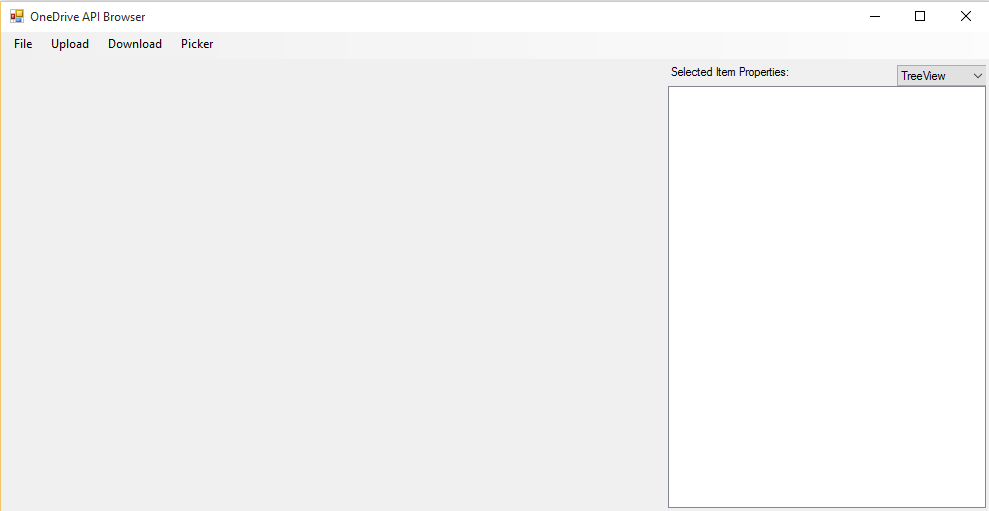
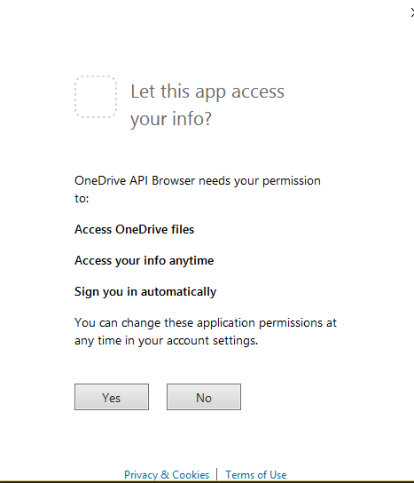

# OneDrive API Browser Sample

The OneDriveAPIBrowser sample is a [Windows Forms](https://msdn.microsoft.com/en-us/library/dd30h2yb(v=vs.110).aspx) app sample that uses the [Microsoft Graph .NET Client Library](https://github.com/microsoftgraph/msgraph-sdk-dotnet) for C#/.NET. In this sample, users can browse files and folders that are stored on OneDrive, and view metadata.

## Register and configure the application

1. Sign into the [App Registration Portal](https://apps.dev.microsoft.com/) using either your personal or work or school account.  
2. Select **Add an app**.  
3. Enter a name for the app, and select **Create application**. The registration page displays, listing the properties of your app.  
4. Under **Platforms**, select **Add platform**.  
5. Select **Mobile application**.  
6. Copy the Client Id (App Id) value to the clipboard. You'll need to use it in the sample app. The app id is a unique identifier for your app.   
7. Select **Save**.  

## Set up

1. Install [Visual Studio](https://www.visualstudio.com/downloads/download-visual-studio-vs) and all available updates, if you don't already have it. 
2. Download the OneDriveAPIBrowser sample from [GitHub](https://github.com/OneDrive/onedrive-sample-apibrowser-dotnet) or create your own fork of the repository.
3. From Visual Studio, open the **OneDriveApiBrowser.sln** solution.
4. Go to the OneDriveApiBrowser project in the solution and view the code for FormBrowser.cs.
5. Configure the sample to use the Client Id (App Id) that you registered by making it the value of the `MsaClientId` variable:
```csharp
        private const string MsaClientId = "Insert your client ID here";
```

## Run the sample

In Visual Studio, select the sample OneDriveAPIBrowser from the Startup project list, and then press **F5** or click **Start** to run the sample. The sample looks like this: 



### Sign-in
When the OneDrive API Browser app opens, choose **File** | **Sign in...** to sign in to a personal OneDrive account or to a business OneDrive account. Once you have signed in to your Microsoft account, a dialog will appear, asking for permissions to access OneDrive files.



Click **Yes**.

### After sign-in

Your OneDrive items will appear on the left pane, with each item represented by a thumbnail. On the right pane, the selected item's properties are displayed. You can choose how the item properties are displayed, whether its JSON or Tree View.

To upload a file, choose **Upload** from the menu and then choose **Simple - Path-based** to upload by path, or **Simple - ID-based** to upload by item id.

To download a file, select a file, and then choose **Download** from the menu.

## API features

### Retrieving an authenticated client

This sample gets a Microsoft Graph **GraphServiceClient** instance and signs in the user using  the **GetAuthenticatedClient** method in the **AuthenticationHelper.cs** file.
```csharp

public static string[] Scopes = { "Files.ReadWrite.All" };
...
        public static GraphServiceClient GetAuthenticatedClient()
        {
            if (graphClient == null)
            {
                // Create Microsoft Graph client.
                try
                {
                    graphClient = new GraphServiceClient(
                        "https://graph.microsoft.com/v1.0",
                        new DelegateAuthenticationProvider(
                            async (requestMessage) =>
                            {
                                var token = await GetTokenForUserAsync();
                                requestMessage.Headers.Authorization = new AuthenticationHeaderValue("bearer", token);
                                // This header has been added to identify our sample in the Microsoft Graph service.  If extracting this code for your project please remove.
                                requestMessage.Headers.Add("SampleID", "uwp-csharp-apibrowser-sample");

                            }));
                    return graphClient;
                }

                catch (Exception ex)
                {
                    Debug.WriteLine("Could not create a graph client: " + ex.Message);
                }
            }

            return graphClient;
        } 
...
```

The **AuthenticationHelper.cs** file also provides a **SignOutAsync** method to easily sign the user out:

```csharp
        public static void SignOut()
        {
            foreach (var user in IdentityClientApp.Users)
            {
                user.SignOut();
            }
            graphClient = null;
            TokenForUser = null;

        }
```

### Get item properties

This sample demonstrates how to get an item's properties, by calling the **GetAsync** method of the **GraphServiceClient** object:

```csharp
folder = await this.graphClient.Drive.Root.Request().Expand(expandValue).GetAsync();
```

### Simple item upload

This sample makes use of Microsoft Graph's ability to upload items by path or by id. 
Here, you upload an item by path:

```csharp
// Since the ItemWithPath method is available only at Drive.Root, we need to strip
// /drive/root: (12 characters) from the parent path string.
string folderPath = targetFolder.ParentReference == null
	? ""
	: targetFolder.ParentReference.Path.Remove(0, 12) + "/" + Uri.EscapeUriString(targetFolder.Name);
	var uploadPath = folderPath + "/" + Uri.EscapeUriString(System.IO.Path.GetFileName(filename)); 

// Use the Microsoft Graph SDK to upload the item by path.
var uploadedItem =
	await
	this.graphClient.Drive.Root.ItemWithPath(uploadPath).Content.Request().PutAsync<DriveItem>(stream); 

```

This example shows how to upload an item by id:
```csharp
var uploadedItem =
	await
	this.graphClient.Drive.Items[targetFolder.Id].ItemWithPath(filename).Content.Request()
                                    .PutAsync<DriveItem>(stream); 
```

## More resources

You can continue to explore this sample and the rest of its features by using GitHub or Visual Studio. To view a Windows Universal app sample that uses the Microsoft Graph SDK for CSharp/.NET, see [OneDrivePhotoBrowser](https://github.com/OneDrive/graph-sample-photobrowser-uwp). Make sure to also check out the Microsoft Graph API's official documentation at [https://developer.microsoft.com/en-us/graph/](https://developer.microsoft.com/en-us/graph/). 

## License

[License](LICENSE.txt)

This project has adopted the [Microsoft Open Source Code of Conduct](https://opensource.microsoft.com/codeofconduct/). For more information see the [Code of Conduct FAQ](https://opensource.microsoft.com/codeofconduct/faq/) or contact [opencode@microsoft.com](mailto:opencode@microsoft.com) with any additional questions or comments.
